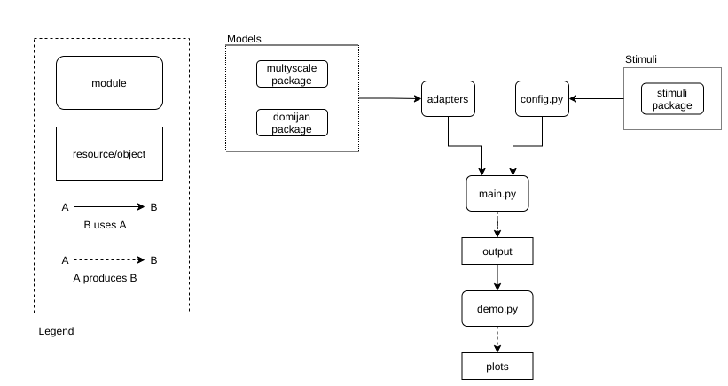
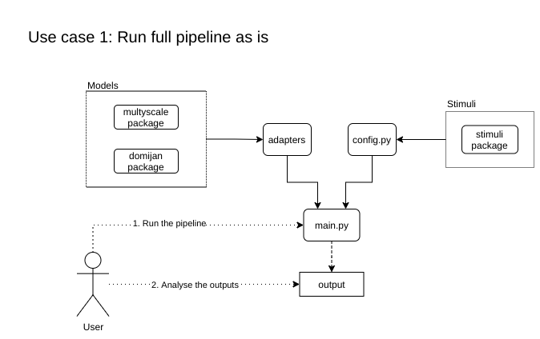
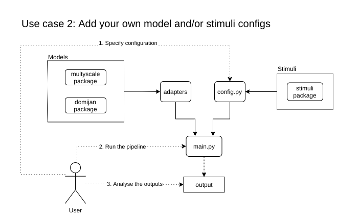
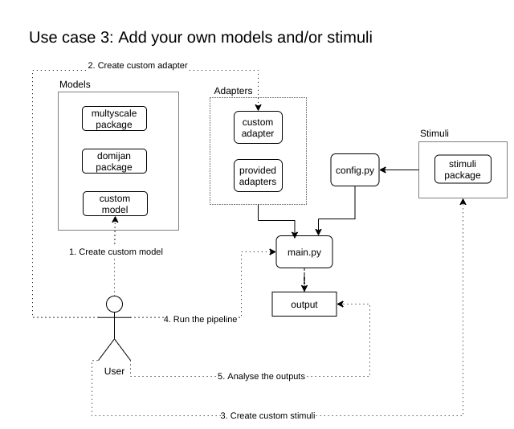

### Overview
The pipeline has 4 major elements:
* Input stimuli
* Brightness models
* Config.py + main.py + adapters (the core of the pipeline)
* Outputs
Here is a schematic view of how it all fits together:  


`config.py`, `main.py` and the adapters make the heart of the pipeline. In `config.py` all the models and stimuli to be 
run are specified and `main.py` then 'simply' executes all the models on all the stimuli using runner function from the adapters directory. 
In order to do that, all the stimuli and models need to be specified in `config.py`. After all the models have been run, 
`main.py` will produce a single output object containing all the outputs of different models for the specified stimuli. 
A demo script `demo.py` then takes these outputs and plots them to the screen.
In the sections below, you can find a more detailed overview of each of these components.

### Use cases
1. User: Run full pipeline as is 
   In this use case, the user simply wants to run the pipeline using the default configuration and analyse the produced results. 
   In this use case, the user only needs to run the `main.py` and then analyse the results in whichever way he wants. 
   This will be the results from the default set of stimuli and models provided with the pipeline. 
   Users falling under this use case should only read 'outputs' section below to learn about the exact form of the output.
   `Main` section is not necessary, but might provide some insights into the working of the pipeline for those interested.  



1. User+: Add your own model and/or stimuli configs 
   In this use case, user wants to run a specific set of stimuli and/or models with custom parameters that he wants to 
   specify himself. All the stimuli and models in this set are assumed to be part of one of the model/stimuli packages 
   that come with the pipeline. Users falling under this use case should read sections `config` and `outputs` below. 
   Config to learn how to specify models, stimuli and their parameters in the `config.py` and outputs to learn about 
   the exact form of the output. `Main` section is not necessary, but might provide some insights into the working of 
   the pipeline for those interested.  



1. Contributor: Provide own models/stimuli
In this use case, user wants to add custom models and/or stimuli into the pipeline. Users falling under this use case 
   should read sections `Models`, `stimuli`, `adapters` `config` and `outputs` below. Models, stimuli and adapters 
   to learn how to specify the models/stimuli, and their interfaces; config to learn how to specify models and stimuli,
   and their parameters in the `config.py`; and outputs to learn about the exact form of the output. `Main` section is 
   not necessary, but might provide some insights into the working of the pipeline for those interested.  
   



### Main.py

`main.py` is the heart of the whole pipeline. Even though it is quite simple module, it's where the magic takes place. 
At this point, there is only one function inside it - the main function:
``` Python
def main(config_module='config', config_dict='config'):

    # These two lines allow dynamic loading of config dict based on the passed parameters
    config_module = importlib.import_module(config_module) # load config module
    config = getattr(config_module, config_dict) # load config dict from the config module

    outputs = {}
    for model in config["models"]:
        print("Running model " + model["name"])
        runner = eval(f"adapters.{model['package']}.main")
        outputs[model["name"]] = runner(model["model"], model["params"], config["stimuli"])
    return outputs
```

This function takes two optional arguments and returns the output of the pipeline. Let's analyse it line by line.  
The two arguments are config_module and config_dict. By default, they refer to the `config.py` module and config 
dictionary inside the `config.py`. In case user has multiple config modules or multiple config dictionaries inside the 
same `config.py` module, this functionality allows easy switching between them. First two lines of the function 
handle dynamic loading of the necessary config module (first line) and getting the right variable from it (second line).  
Afterwards an empty dictionary is created where the outputs of each model will be placed. The function loops through 
all models specified in the config file. For each model it calls appropriate runner function from the adapter directory 
based on the package name specified in the config file. Each runner function must accept a model, model parameters, 
and a list of stimuli (check the `models` section further down for more info). All three of those are read from the 
config dict and passed to the runner function. Finally, the outputs dict is returned.


### Outputs
As could be seen from the previous section, the pipeline returns outputs in the form of a dictionary. The output dictionary has this format:
```
{
"model1": {
    "stimulus1": {
            "image": image_output,
            "output_param1": output_param1,
            "output_param2": ...,
            ...
            },
    "stimulus2": {...},
    ...           
    },
"model2": {...},
...
}
```

It is a dictionary where each key is a string representing one of the models. For each key/model, the value is also 
a dictionary. Each key in this nested dictionary is a string representing one of the stimuli passed from the config file. 
For each of these stimuli/keys, the value is also a dictionary representing the output of the model for that specific 
stimulus. Since different models can have widely different outputs, these keys differ between the models. 
The only required key is the "image" one, and it stores model's brightness estimation for this stimulus. It is required 
to facilitate plotting of the outputs for all the models.


### Config
If `main.py` is the heart of the pipeline, then `config.py` is definitely its brain. This is the place where all the 
parameters and specifications are put that decide what gets run and in which way. The way this is done is to put all the
models and stimuli inside one configuration dictionary that is read by the `main.py`. This dictionary has a specific 
structure that can be seen in `config_template.py` together with a simple example. This structure is as follows:

```python
config_template = {
    "models": [
        {
            "name": "<User assigned name>>",
            "model": "<Name of the model to be run, can be found in the documentation of the package>",
            "package" : "<Package containing the model>",
            "params": "<Dictionary of model parameters, depends on the model>"
        },

        ],
    "stimuli": {
        "<User assigned stimulus name>": "<Stimulus array>",
    }
}
```
The dictionary contains two keys, `models` and `stimuli`. Let's look at the `models` one first.  
It is a list of dictionaries where each dictionary represents one model to be run. For each model, there are four keys: `name`, `model`, `package` and `params`.  
`name` is a user assigned name of the model. It can be any string and is used in the output dictionary as key containing outputs of this model for all stimuli.  
`model` is a string specifying which model from the package needs to be run exactly. For a list of available models, 
you should check the documentation of the package. In case package contains only one model and no model needs to be specified, 
this should be an empty string.  
`package` is the name of the package containing the model you want to run.  
`params` is a dictionary containing all the necessary parameters for the given model. These parameters vary widely 
between different models, so you should check the package documentation for the parameters that are needed in a given model.  
Here is an example of what a config dictionary might look like:

```python
config_example = {
    "models": [
        {
            "name": "domijan2015",
            "model": "",
            "package": "domijan2015",
            "params": {"S": 20}
        },
        {
            "name": "multyscale_ODOGBM1999",
            "model": "ODOG_BM1999",
            "package": "multyscale",
            "params": {"visextent": (-16, 16, -16, 16)}

        },
        ],

    "stimuli": {
        "RHS2007_WE_circular": stimuli.papers_stimuli.RHS2007.WE_circular1(), # Stimulus array
        "benary_cross": stimuli.illusions.benary_cross.domijan2015(),
    }
}
```

In this case two models will be run: `domijan2015` from `domijan2015` package and `ODOGBM1999` from `multyscale` package. 
Because `domijan2015` package only has one model, an empty string is passed as `model` parameter. 
For each of these two models, two stimuli are passed: `WE_circular` from `RHS2007` paper and `benary_cross` from `domijan2015` paper. 
This means that output dictionary will contain four outputs in total.


### Stimuli
By default, the way to generate the pipeline stimuli is using the `stimuli` package. Users are welcome to use stimuli 
coming from other sources as long as they conform to the standard. The only requirement is for stimuli to be two-dimensional, 
floating point numpy arrays. These stimulus arrays need to be passed in the `config.py`.   
**Important**: you need to pass the actualy array, not just a reference to a function/class generating it.


### Models and adapters
Models provided together with the pipeline are parts of various different packages. For an overview of all the available models 
check **(link to the overview here)**. It is possible to use your custom models, but it is a bit trickier than with the stimuli.  
Due to the fact that different models from different packages differ **dramatically** in the way they are run, and the parameters they accept, 
each package requires an interface in order to be able to work with the pipeline. This interface takes form of a `main()` function 
inside one of the modules in `adapters` directory. Each package has one adapter module and one `main()` function. 
Each `main` function has to accept three parameters: `model`, `params` and `stimuli`. 
`model` is a string specifying which model from that package needs to be run, 
`params` is a dictionary containing necessary configuration parameters for that model and 
`stimuli` is a dictionary of the form: `{"stimulus name": stimulus_array}` containing one or more stimuli. 
The function then takes care of doing whatever it takes to run this model for these input stimuli and returns the result to the pipeline. 
The result needs to be a dictionary where each key is a stimulus name and value is a dictionary containing the output of the model for that stimulus. 
This output can contain arbitrary keys and values (depending on the type of output that the model produces), but must contain an `image` key 
holding a two-dimensional numpy floating point array specifying the brightness estimate of that model for that input stimulus. 

If a user wants to run some custom models, which are not provided by default, that is very much possible.  
First step is creating an adapter module inside the `adapter` directory the `main()` function as described above. 
Second step is adding that module inside the `__init__` file in the `adapters` directory. E.g., if a user wants to add package `foo`, they should
create a file called `foo.py` inside the `adapters` directory, put the `main()` function inside that file and then add `from . import foo` in the `__init__.py`
file in the adapters directory.
